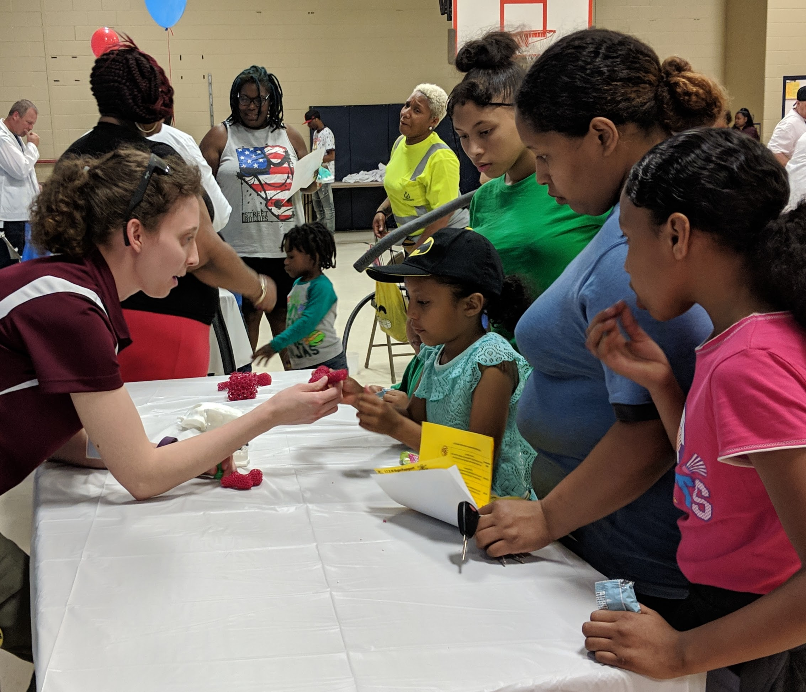
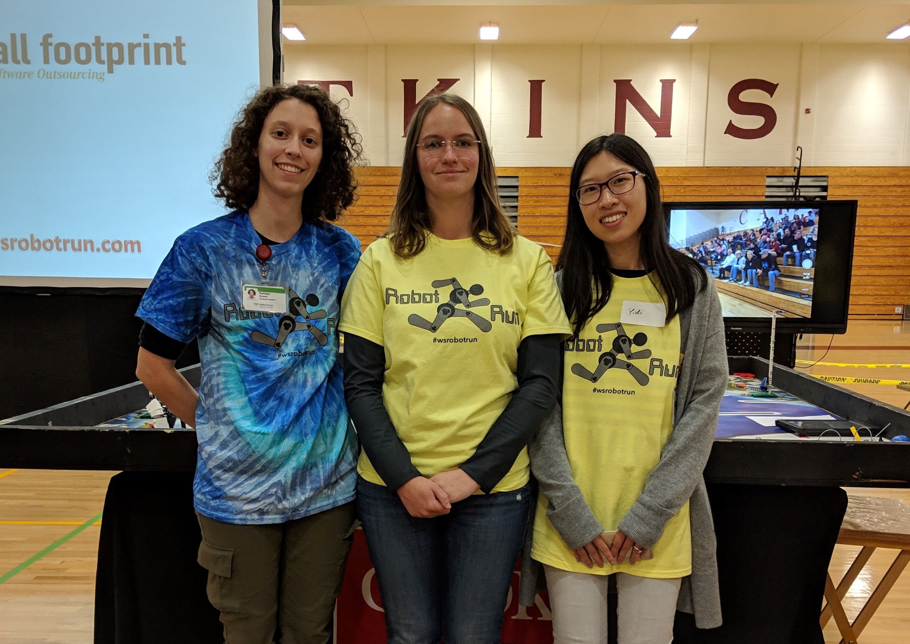
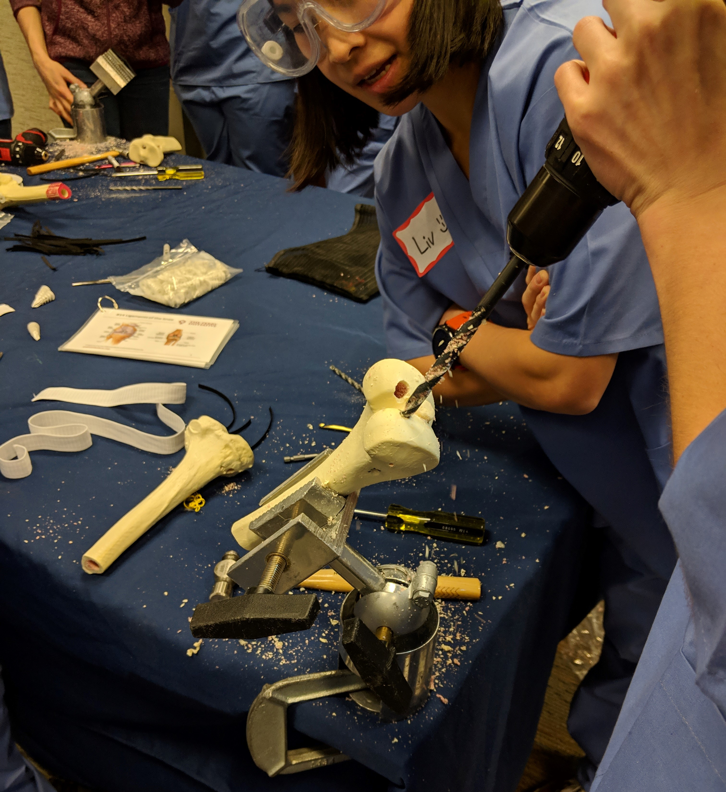

As an engineer, I believe it is one of my core responsibilities to inspire the next generation of young scientists and engineers through low-pressure fun activities that encourage STEM literacy and problem solving. I have become especially interested learning how to support and advocate for students from underrepresented groups, especially those from schools with limited access to in-class science curriculum and to after-school STEM clubs. 

## K-12 School Outreach
I enjoy visiting classrooms and school science events to give demos, serve as a guest speaker, and judge student projects. 

### Petree Elementary School STEM Night
Below is a picture from Petree Elementary STEM Night, where I brought 3D printed bones to teach the kids about the structure of bones and how they can be strong but also lightweight. 

## FIRST Robotics
In high school, my experience on a FIRST robotics team (Team 1717 D'penguineers) as a mechanical designer was instrumental in my decision to pursue engineering as a career. Over the years, I have used the technical skillset I've developed to mentor several FIRST Lego League teams, serve as an instructor for robotics summer camps, and also volunteer for several local and regional FIRST competitions. 

### Winston-Salem Robot Run
In 2017 and 2018, I was a technical design judge and assistant head judge at the annual Winston-Salem Robot Run, which brings together FRIST Lego League teams from over 10 local middle schools to compete with their robots.

## Women in STEM
By the time girls reach high school, they've generally already formed an idea of whether they'd fit into a STEM career. It's my goal to expose girls to the opportunities they have in STEM by connecting them to successful women in all career stages. As a graduate of one of the top engineering universities in the world (Go Bears!) and now a engineering PhD candidate, I'm passionate about serving as a role model for young girls. 

### Regan High School Women in BME Day
In May 2019, I alongside my fellow PhD student [Andrea Mazzocchi](https://twitter.com/A_Mazzocchi) organized an afternoon visit to the Biomedical Engineering Department at the Wake Forest School of Medicine. We gave the high school students an overview of the career paths in biomedical engineering, hosted a graduate student panel, and led them on group tours of the research labs. 

### Girls Who Code
I am a co-facilitator of the Girls Who Code club at the Malloy/Jordan East Winston Heritage Center.  I have experience both developing and teaching project-based curricula to teach elementary and middle school aged girls the fundamentals of computer science and coding syntax. Below is a picture of one of our facilitators, Madison, teaching the girls about loops! 

### Perry Initiative
The [Perry Initiative](https://perryinitiative.org) is an phenomenal program that travels around the country to run hands-on outreach programs for women students in high school, college, and medical school. 

In 2018 and 2019, I assisted as an on-site volunteer at the Wake Forest School of Medicine location along with several other students and faculty in Biomedical Engineering and Orthopaedic Surgery. This one-day workshop to introduces young women in high school to fracture fixation techniques and power tools and encourages them to pursue careers in engineering and orthopaedic medicine. 

